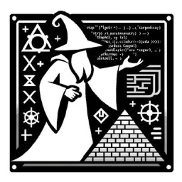

# StarkWizard 🪄



**StarkWizard** is a state-of-the-art Language Model (LLM) tailored for the Cairo smart contract language of StarkNet. With our meticulously designed training process and dedicated integration with StarkNet's intricacies, we aim to provide a robust and reliable LLM for all your Cairo smart contract needs.

## Table of Contents

- [StarkWizard 🪄](#starkwizard-)
  - [Table of Contents](#table-of-contents)
  - [Features](#features)
  - [Installation](#installation)
  - [Usage](#usage)
  - [Directory Structure](#directory-structure)
  - [Contribution Guidelines](#contribution-guidelines)
  - [Support \& Feedback](#support--feedback)
  - [License](#license)

## Features

- **Cairo LLM Integration**: Crafted specifically for Cairo's smart contract language.
- **Training script**: A cross-platform script to train the model on Windows/Linux/MacOS.
- **Merge Capabilities**: Seamlessly merge the training weights of PEFT with the original model(s).
- **Quantization**: AWQ (PC only) and GGUF notebooks to generate quantized versions of the merged models.


## If you just want to use the model for inference

please visit:

[StarkWizard On Hugging Face](https://huggingface.co/StarkWizard) See [LM Studio](https://https://lmstudio.ai/) for a UI to chat with the model

## Installation

Create a venv and install the requirements

```bash
pip install -r requirements.txt
```

If you are on Apple Silicon platform, please use the following:

```bash
pip install -r requirements-Mac.txt
```

Apple Silicon requires to install the nightly build of pyTorch, to get support of MPS

Activate the venv

```bash
conda activate cairo-llm
```

## Usage

**If you want to train or merge, you first need to install wizardlib.**
You only need to install the lib for training and merging.

```bash
cd wizardlib
pip install -e .
```

**Building the dataset**

If you have modified the corpus, you will need to rebuild the associated dataset.
Please note that you need some special rights and be part of the HF StarkWizard organization to push to the StarkWizard HF repo.

get into the "0 buidl datasets" directory and run the first 2 cells of the notebook

**Training:**

If you are on mac, and want to train code-llama-instruct

```bash
cd 1-train
./mac-train-llama.sh
```

on other plateforms:

```bash
cd 1-train
./train-llama.sh
```

Please create custom sh files in order to tweak the training parameters parameters.

Follow this link to get a list of the available params [Training Parameters](doc/train.md)

**Merging:**

The training outputs a PEFT model that can be merged to the original model in order to get a full model. Use the merge.py script

```bash
cd 2-merge
python merge.py
```

Please find the parameters for merging [Merging Parameters](doc/merge.md)

The merged model is uploaded after merging. You need to get authorization to push to the HF StarkWizartd repos

**Quantizing:**

Two notebooks are proposed to generate AWQ and GGUF quantitization. Please note that AWQ is not supported on Apple Silicon.

## 

## Directory Structure

```
StarkWizard/
│
├── 0-build datasets/ # Contains a notebook to merge csv and upload the resulting dataset
│
├── 1-train/ # the train.py command
│
├── 2-merge/ # The merge.py command
│
├── doc/ # md files for merge and train
│
├── backup/ # POC of this project, outdated and useless
│
├── wizarlib/ # A lib used for convenient functions shared accross scripts
```

## Contribution Guidelines

StarkWizard is an open-source project, and we welcome contributions of all kinds: new models, bug fixes, improvements to the documentation, and more. See our [contributing guide](CONTRIBUTING.md) for more details on how to get started.

## Support & Feedback

For support, questions, or feedback, please open an issue or mail wizard@starkwizard.com.

## License

StarkWizard is open-sourced under the [MIT License](LICENSE). See the LICENSE file for more details.

---

[](https://codeium.com)
